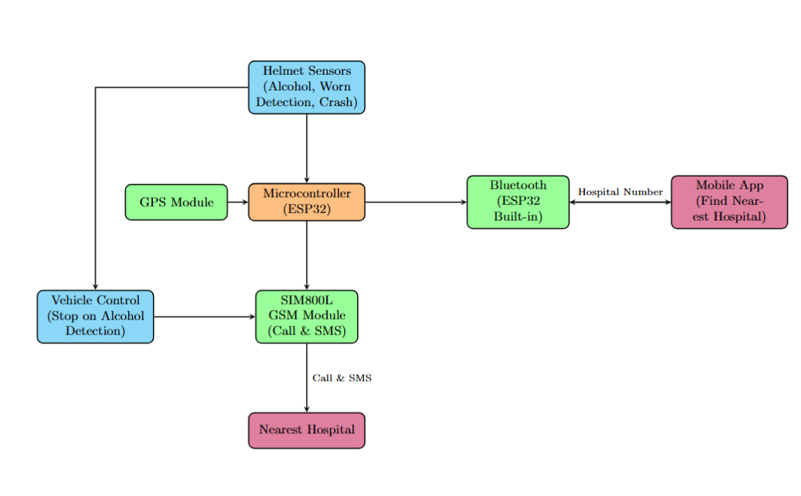

# Smart Helmet with Alcohol Detection and Emergency Alert System

## Introduction
This project enhances rider safety by integrating advanced sensors and communication modules into a motorcycle helmet. The smart helmet detects alcohol consumption, verifies helmet usage, and senses crashes. If alcohol is detected, the system disables the vehicle ignition to prevent drunk driving. In case of an accident, it sends the rider's GPS location to a mobile app, which finds the nearest hospital and sends back the contact number. The helmet then automatically calls the hospital via the SIM800L GSM module and optionally sends an emergency SMS to a family member.

## Features
- Alcohol detection to prevent drunk driving by disabling vehicle ignition
- Helmet wearing detection to ensure safety compliance
- Crash detection for immediate emergency response
- GPS location tracking and transmission
- Mobile app integration to locate the nearest hospital
- Automatic calling and SMS alerts via SIM800L GSM module

## How It Works
1. The helmet sensors monitor the rider’s alcohol level, helmet status, and detect collisions.
2. If alcohol is detected, the microcontroller disables the vehicle ignition to prevent drunk driving.
3. Upon detecting a crash, the GPS module provides the rider’s location.
4. The ESP32 sends this location to the mobile app via Bluetooth.
5. The mobile app determines the nearest hospital and sends the hospital’s contact number back to the ESP32.
6. The SIM800L GSM module automatically calls the hospital and sends an optional SMS alert to a family member.

## Project Timeline

### Weeks 1–2: Planning and Hardware Preparation
- Requirement analysis and literature review to understand existing solutions and finalize system objectives.  
- Research, select, and order all necessary hardware modules (ESP32, alcohol sensor, crash sensor, SIM800L GSM, GPS module, etc.).

### Weeks 3–5: Sensor Prototyping and Testing
- Set up the ESP32 and prototype the alcohol sensor for detecting alcohol levels.  
- Implement helmet wearing detection using IR or pressure sensors and test accuracy.  
- Integrate the crash detection sensor (e.g., MPU6050/ADXL345) and calibrate with real-time data.

### Weeks 6–8: Location & App Communication
- Interface the GPS module and validate accurate location tracking.  
- Establish Bluetooth communication between the ESP32 and a custom mobile app.  
- Begin mobile app development to receive GPS data and return the nearest hospital’s contact number.

### Weeks 9–10: GSM Alerts and Ignition Control
- Integrate the SIM800L GSM module to automatically call a hospital and send SMS alerts to emergency contacts.  
- Implement logic to disable vehicle ignition if alcohol is detected, enhancing rider safety.

### Weeks 11–12: Full System Integration and Debugging
- Combine all components: sensors, communication modules, control logic, and app interface into a single cohesive system.  
- Perform thorough testing, troubleshoot integration issues, and optimize performance.

### Weeks 13–14: Final Testing and Documentation
- Conduct real-world testing for system validation and reliability assessment.  
- Prepare complete project documentation, user guides, and final technical report.
